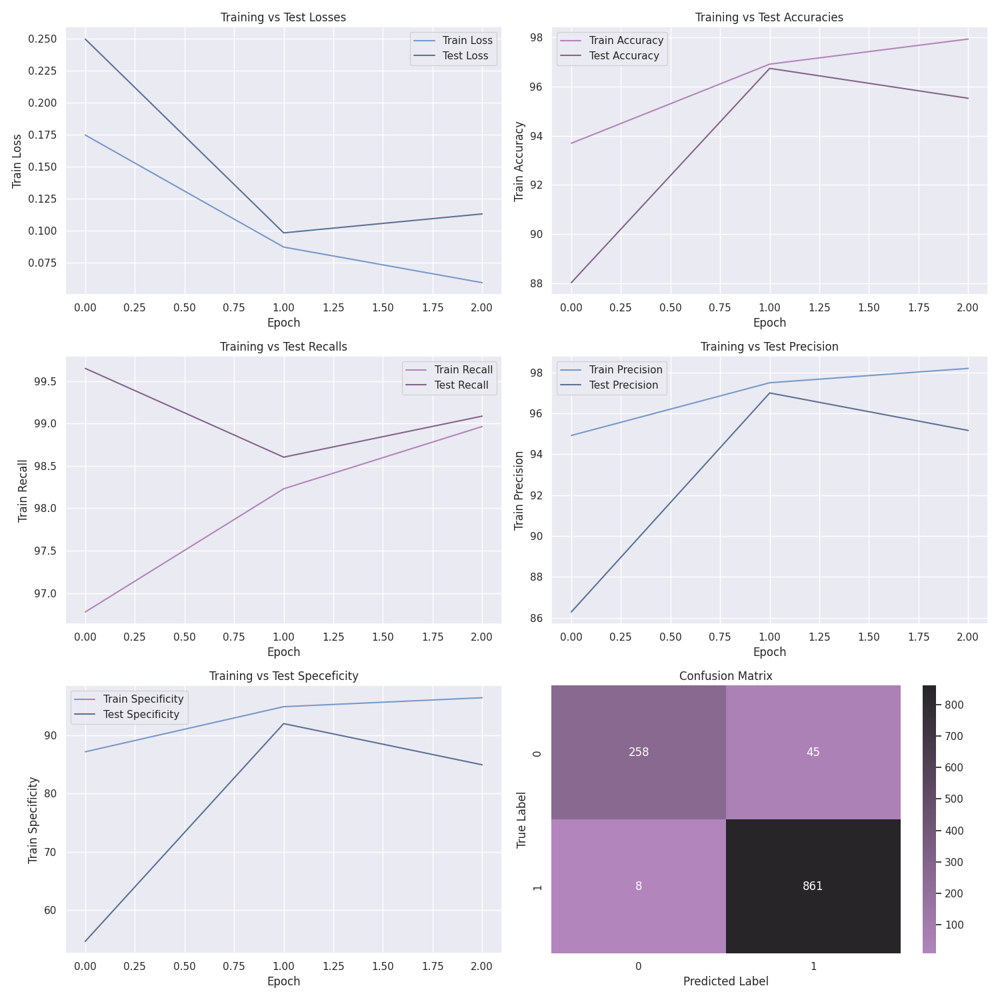

# Pneumonia Identifier: 
Pneumonia, if left untreated can be fatal, with complications ranging from respiratory failure, sepsis, to lung abscesses. Streamlining the radiology process with neural networks would yield increased efficiency by removing the human element, which can be crucial in times of strain on our medical systems. In a study by [Kermany et al. (2018)](https://www.cell.com/cell/fulltext/S0092-8674(18)30154-5), deep learning models were deployed on a dataset containing x-ray images of patients that were either healthy or diagnosed with pneumonia. I decided to recapitulate the modeling aspect of this study on my own, I modified a pretrained ResNet-18 convolutional neural network to have two classes, and then trained the model on the new dataset.

<div align="center">
  
</div>
<br>

# Data Modifications:
The original dataset came with individual class folders, pre-separated into training, validation, and testing splits. Due to my pipeline performing the splits, [I decided to place the images into one large folder](dataproc.ipynb) to then be split before training. Afterwards, the data was ready to be trained on. 
<br><br>
The dataset had varying proportions of classes, which were split at random to training and testing datasets:

| Class    |Image Count|Proportion|
|----------|----------|----------|
| Pneumonia| 4273   | 0.73      |
| Healthy  | 1583   |0.27       |

```
Training set label counts: Counter({1: 3404, 0: 1280})

Training set label proportions:
Label 1: 0.727
Label 0: 0.273
```
```
Testing set label counts: Counter({1: 869, 0: 303})

Testing set label proportions:
Label 1: 0.741
Label 0: 0.259
```

# Experiment 0:
My first model had ResNet-18 architecture adjusted to compensate for 2 classes. Additionally, the model came with pretrained weights, with the weight set orignating from ImageNet-1K. The model learned quickly on the dataset, with the 3rd epoch not being necessary for the training cycle.

<div align="center">
  
</div>