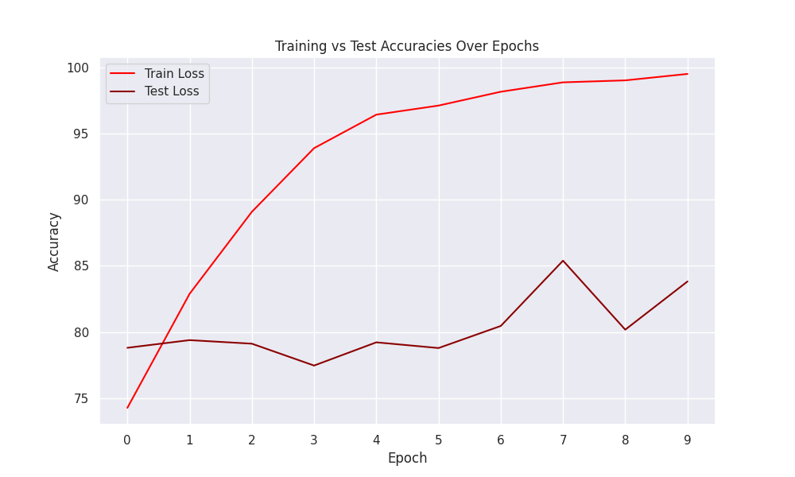
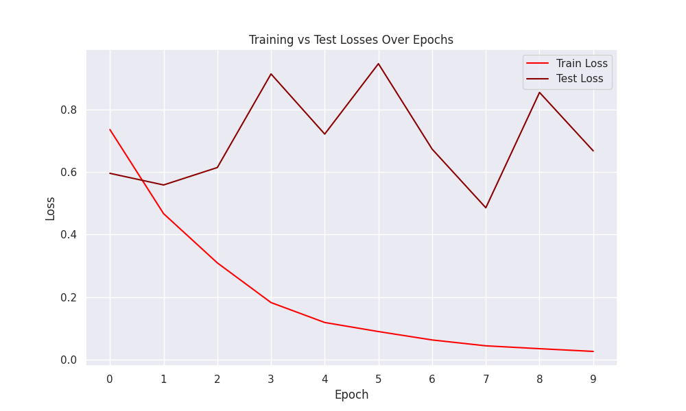
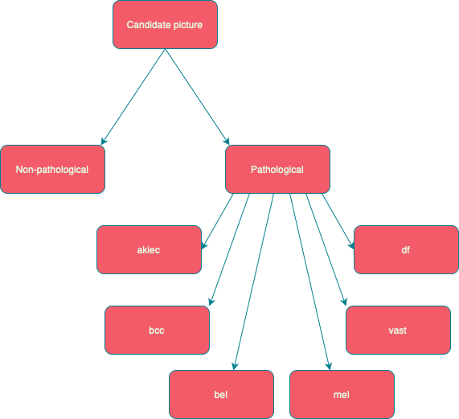

# Skin Cancer MNIST: HAM10000:
This dataset contains 10,000 images of different dermastopic images with labels attached to them. The classes contained within the dataset were composed of:
* Actinic keratoses and intraepithelial carcinoma / Bowen's disease (akiec)
* Basal cell carcinoma (bcc) 
* Benign keratosis-like lesions (solar lentigines / seborrheic keratoses and lichen-planus like keratoses, bkl)
* Dermatofibroma (df)
* Melanoma (mel)
* Melanocytic nevi (nv) 
* vascular lesions (angiomas, angiokeratomas, pyogenic granulomas and hemorrhage, vasc). 


| Class    | Image Count| Proportion |
|----------|----------|----------|
| nv   | 6705     | 0.669    |
| mel    | 1113     |0.111     |
| bkl     | 1099    | 0.110   |
| bcc    | 514    | 0.051     |
| akiec    | 327     | 0.033   |
| vasc   | 142    |  0.014     |
| df     | 115     |0.011     |

Upon viewing the dataset, I made a goal to make a multiclass classification program which utlized a convolutional neural network (CNN) created through PyTorch. Throughout my experiments, I made changes (not all cataloged) to my program to better classify between groups.
# Data Cleaning:
Basic data cleaning and setup occurred in the [dataproc.ipynb](dataproc.ipynb). Image files were sorted into class folders in preparation for conversion into training and testing datasets down the road.
# Experiment 0:
My first model had resnet34 architecture adjusted to compensate for 7 classes. Additionally, the model came with pretrained weights, with the weight set orignating from ImageNet-1K. The first experiment showed issues with divergence of both the losses and accuracies starting at around epoch 1. 

### Accuracy Plot:
<div align="center">
  
</div>

### Loss Plot:

<div align="center">
  
</div>

### Troubleshooting:
One glance at my graphs and it's apparent that there's an issue with overfitting with my model. My first steps were to look at the proportions of classes in my training vs. testing datasets, as some of my classes were small and variations created from chance could have a profound effect. The proportions returned the following:

```
Training set label proportions:
Label 0: 0.033
Label 1: 0.051
Label 2: 0.110
Label 3: 0.011
Label 4: 0.114
Label 5: 0.667
Label 6: 0.014
```
```
Testing set label proportions:
Label 0: 0.032
Label 1: 0.052
Label 2: 0.107
Label 3: 0.011
Label 4: 0.100
Label 5: 0.681
Label 6: 0.016
```
Upon looking at the proportional representation of the classes further, I realized that I had to something to compensate for the disproportionate nature of the dataset.

### Future directions:
1) Create 2 neural networks, the first a binary classification network to differentiate between melanocytic nevi and everything else, essentially creating a binary classification network that determines whether or not the area of skin is pathological. Then a second network that serves as a multiclass classification between the different pathologies that which is run depending on the results of the first. 

<div align="center">
  
</div>

2) Make adjustments to the dataset to ensure a greater weight or representation is added to the more disproportiate classes. I'll need to do more research as I have no experience in dataset manipulations in the context of machine learning. 
3)  There are many different routes that one has to take when evaluating models. Right now I think the metrics through which I'm evaluating my models need to have more depth. Loss and accuracy only provide a small insight into the capabilities and efficacy of a model, in my next experiments, I plan on including confusion matrices, along with calculations for recall, precision, and specificity.