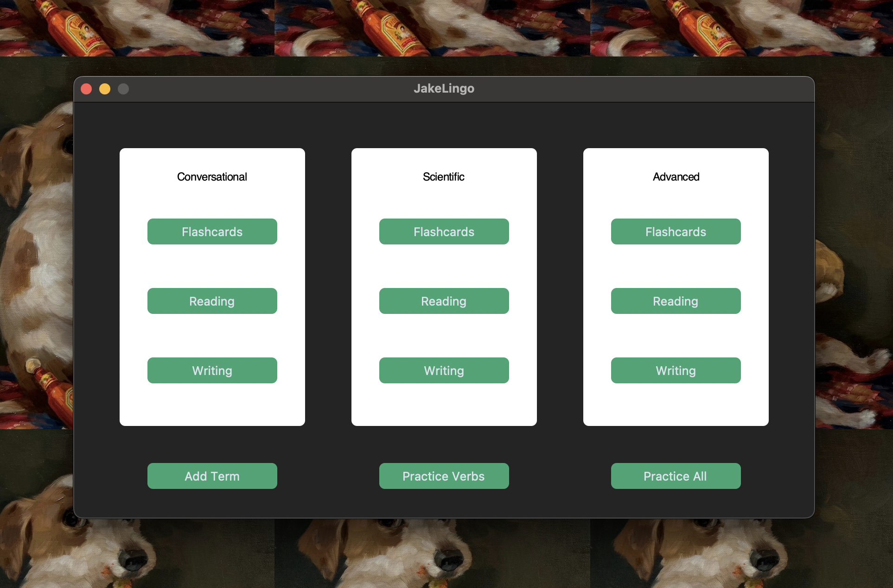
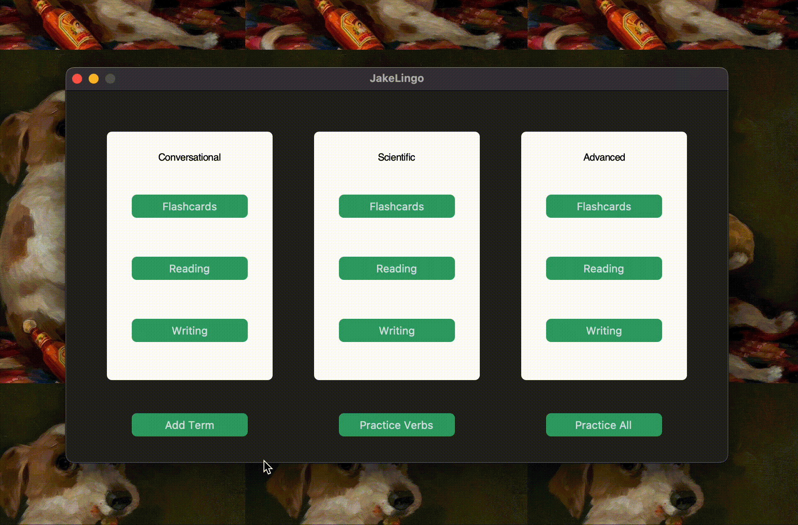
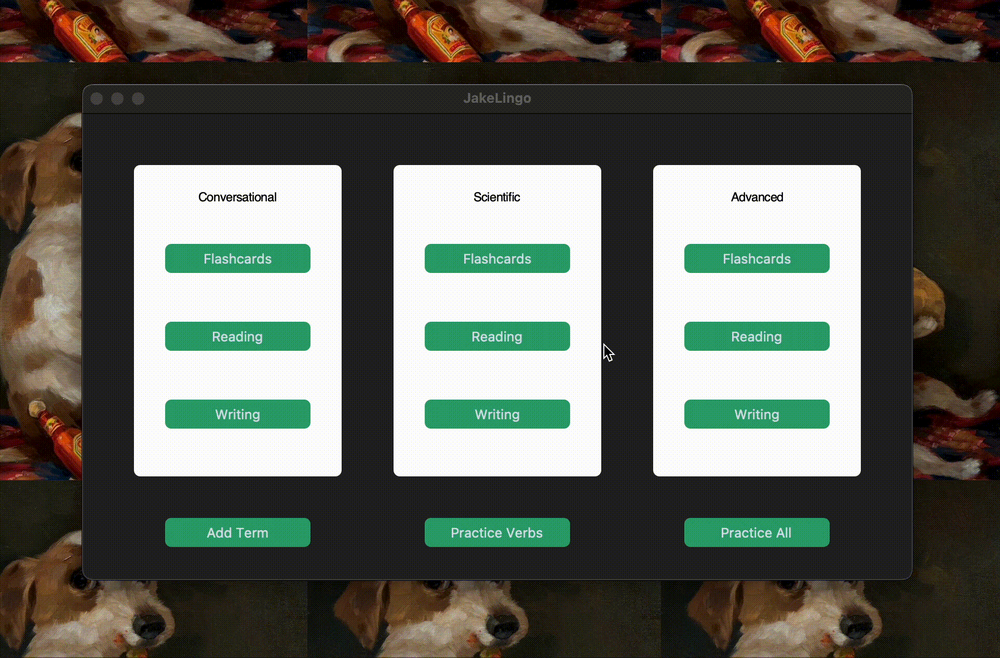
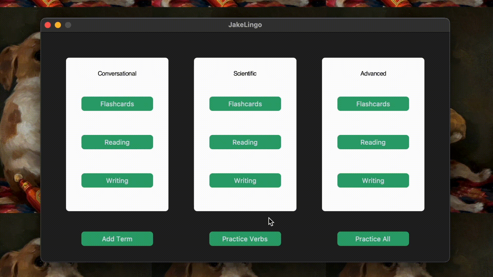

# JakeLingo: A Language Learning Alternative:
Recently, I've seen many folks arguing the inefficacy of learning spanish through Duolingo, and with many other apps behind large paywalls, I decided to create an app geared towards the parts of the language-learning process I struggle with the most. The app was designed around learning reading, writing, and vocabulary in their respective areas, conversational, scientific, and advanced.

  

# Functionality:
## Adding New Terms:

  

A pop-up to add new terms. Terms are automatically translated by google translate. So you only need to add the spanish term, the app does the rest of the processing on the "back-end" of things.

## Flashcards: 

  

In order to approach the vocabulary aspect of my learning, I decided to implement a flashcard option in the app. The functionality is simple and straight forward, featuring 3 buttons to operate the whole thing.

## Reading: 

  

Increasing reading comprehension helps with all parts of spanish, for this part, I implemented a load-in reader. The reader accepts text files and incorporates them into the GUI. Additionally, any unknown words can be added to the vocabulary list for flashcard review for later.

## Writing:

  

Writing towards different audiences is what I wanted to implicate in my practice as well, I incorporated a sort of "journal" to practice writing. The writing section includes a list to access all previously written excerpts, as well as a forward and back button to manually search through ones writing. 

## Verb Tree:

  

A hub to practice conjugations in different tenses, you are provided with a word and an empty verb tree to practice conjugations. 